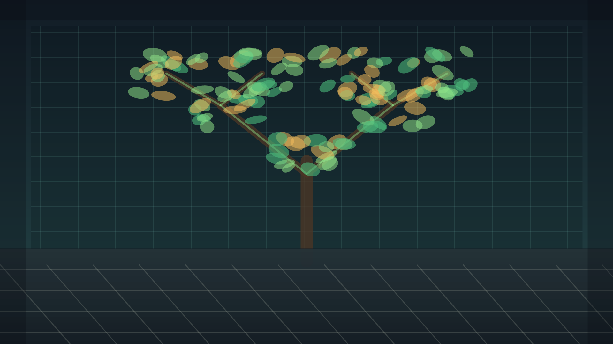
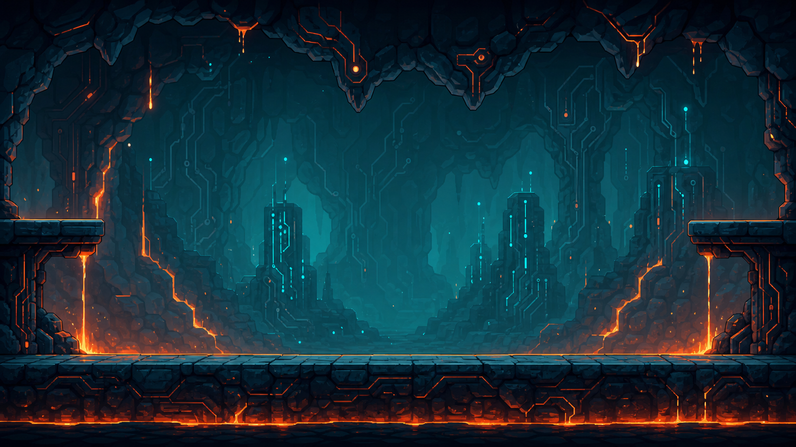
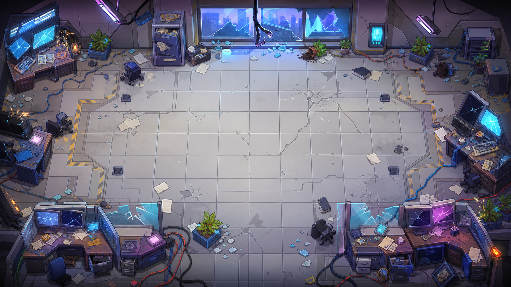

# Junior Quest: The Job Hunt

Junior Quest is a single-player browser game built with Phaser 3, TypeScript, and Vite.

The game follows a junior developer through a humorous version of the modern high-tech job search: a career fair, technical interviews, algorithm challenges, competition with other candidates, and a final battle against an automated hiring machine.

## Screenshots








## Play Locally

```bash
npm install
npm run dev
```

Then open the local URL printed by Vite.

## Build

```bash
npm run build
```

## Tech

- Phaser 3 game engine
- TypeScript
- Vite
- Runtime assets and generated game art
- Local leaderboard fallback through browser LocalStorage

## Notes

- The game supports Hebrew and English.
- Desktop controls use WASD or arrows for movement, Space or Enter for jumping, and X for actions.
- On iPhone, fullscreen play works best after adding the game to the Home Screen.
